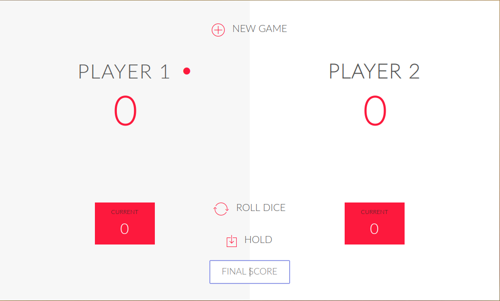

# Simple Dice Game
Learning Javascript by creating simple Dice game.

GAME RULES:

- The game has 2 players, playing in rounds
- In each turn, a player rolls two dice as many times as he wishes. Each result get added to his ROUND score
- BUT, the player looses his current round score when one of the two dice is a 1. After that, it's the next player's turn
- The player can choose to 'Hold', which means that his ROUND score gets added to his GLOBAL score. After that, it's the next player's turn
- The first player to reach 100 points on GLOBAL score wins the game
- You can choose winning score as you wish, but the default is 100.
- Have Fun!xD

